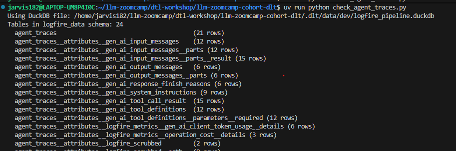
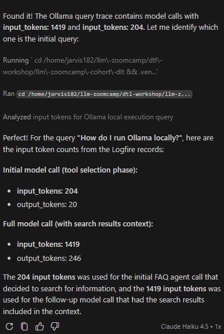
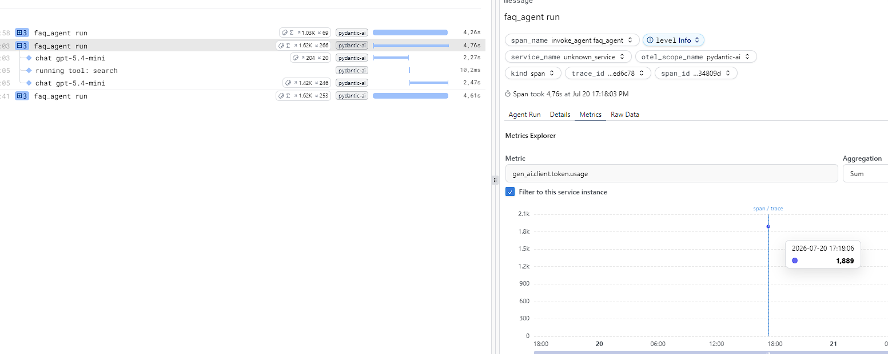

# llm-zoomcamp-cohort-dlt

**Question 1. Instrument the agent with Logfire**

4 spans:

- Agent run
- LLM call
- Tool call
- LLM call

> Answer: 5 (closest)

**Question 2. Load traces into DuckDB with dlt**

For this exercise I used Claude Haiku 4.5 agent to create logfire_pipeline.py and check_agent_traces.py

Dlt created 24 tables total in the DuckDB destination:

- Main table: agent_traces (21 rows)
- 22 normalized child tables: All prefixed with agent_traces__ (e.g., agent_traces__attributes__gen_ai_input_messages, agent_traces__attributes__pydantic_ai_all_messages, etc.)
- 3 dlt internal tables: _dlt_loads, _dlt_pipeline_state, _dlt_version

> Answer: 24

**Question 3. Query traces with an agent**

Using vscode chat - Claude Haiku 4.5 agent:

Total input_tokens = 1623 tokens
Total output_tokens = 266 tokens

TOTAL: 1889 tokens

Comparing with logfire:

TOTAL: 1889 tokens

> Answer: 1500-5000