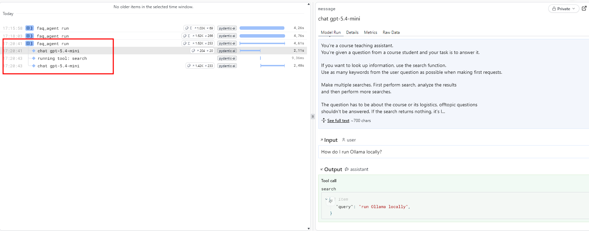

# llm-zoomcamp-cohort-dlt

**Question 1. Instrument the agent with Logfire**

4 spans:

- Agent run
- LLM call
- Tool call
- LLM call

Answer: 5 (closest)

**Question 2. Load traces into DuckDB with dlt**